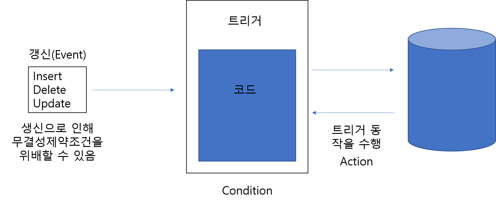

## 데이터베이스

#### 데이터베이스 시스템

##### - 정보와 데이터는 다르다.

데이터: 어떤 값들의 모음.

정보: 데이터를 가공하여 도출해낸 결과.

- 이렇게 수집된 데이터들의 모임을 데이터 베이스(DB)라고 한다

  #### 데이터베이스의 정의

  - 조직체의 응용시스템들이 ``공유``해서 사용하는 ``운영``데이터들이 구조적으로 ``통합``된 (``저장``된)모임이다.

  데이터의 모임

  - 조직체의 응용 시스템들이 공유해서 사용하는 운영 데이터
  - ``저장``된 데이터
  - 응용프로그램들(application system)이 ``공유``하기 위한 것이다.

#### 데이터베이스의 특징

- 데이터베이스는 데이터의 대규모 저장소로서, 여러 부서에
  속하는 여러 사용자에 의해 ``동시``에 사용되며 조직체의 
  모든 구성원이 ``공유``하는 자원
- 모든 데이터가 중복을 최소화하면서 ``통합``됨
- 데이터베이스는 한 조직체의 ``운영`` 데이터뿐만 아니라 그
  데이터에 관한 ``설명``(데이터베이스 스키마 또는 메타 데이터)까지 포함.
- 프로그램과 데이터 간의 ``독립성``이 제공됨
- 효율적으로 접근이 가능하고 ``질의``를 할 수 있음

#### 데이터베이스 관리 시스템

- DBMS: Database Management System
- 데이터베이스에서 필요한 데이터를 _검색_하거나 데이터를 _삽입_, _수정_, _삭제_를 효율적으로 지원하는 프로그램
- 데이터베이스를 정의하고, 질의어를 지원하고, 리포트를 생성하는 등의 작업을 수행하는 ``소프트웨어``
## 두가지 성격의 데이터베이스

#### 데이터베이스 스키마=시스템 카탈로그, 데이터 사전
- 전체적인 데이터베이스 구조를 뜻함 "_틀_"
- 자주 변경되지는 않음
- 내포(intension)라고 부름

#### 데이터베이스 상태
- 특정 시점의 데이터베이스의 _내용_을 의미함
- 시간이 지남에 따라 계속해서 바뀜
- 외연(extension)이라고 부름

### 데이터베이스 시스템(DBS: Database System)의 구성 요소

- 데이터베이스, DBMS, 사용자, 하드웨어
- 데이터베이스 시스템 의미: 4개의 구성요소가 잘 협력하여 방대한 양의 데이터를 잘 관리하는 총제적인 기술

## 1) 데이터베이스

- 조직체의 응용 시스템들이 공유해서 사용하는 운영 데이터들이 구조적으로 통합된 모임
- 시스템 카탈로그(또는 데이터 사전)와 저장된 데이터베이스로 구분할 수 있음
- 시스템 카탈로그(system catalog)는 저장된 데이터베이스의 스키마 정보를 유지

##  2) DBMS

- 사용자가 데이터베이스를 생성, ``데이터베이스의 구조를 <u>명시</u>``할 수 있게 하고, 사용자가 데이터를 효율적으로 질의하고 수정할 수 있도록 하며, 시스템의 고장이나 권한이 없는 사용자로부터 데이터를 안전하게 보호하며, 동시에 여러 사용자가 데이터베이스를 접근하는 것을 제어하는 _소프트웨어 패키지_
- 데이터베이스 언어라고 부르는 특별한 프로그래밍 언어를 한 개 이상 제공(p.40)
- SQL은 여러 DBMS에서 제공되는 사실 상의 표준 데이터 베이스 언어

## 3) 사용자

- 데이터베이스 사용자는 여러 부류로 나눌 수 있음
- p.43

## 4) 하드웨어

- 데이터베이스는 디스크와 같은 <u>보조 기억 장치</u>에 저장되며, DBMS에서 원하는 정보를 찾기 위해서는 디스크의 블록들을 주기억 장치로 읽어들여야 하며, 계산이나 비교 연산들을 수행하기 위해 중앙 처리 장치가 사용됨
- DBMS 자체도 주기억 장치에 적재되어 실행되어야 함.


### 알아야 할  것

- 데이터베이스 시스템이 무엇이냐? 목적을 말할 수 있어야 한다.
- 구성요소가 무엇인지 말하다. 4가지 구성요소( DB, DBMS, 사용자, 하드웨어 )


------

2강

22p

## File system vs. DBMS

filesystem은 과거 데이터를 보관하던 방법. -> 지금 또한 파일이라는 형식을 이용하여 많은 양의 데이터를 저장

이 기능은 시스템 프로그래밍 운영체제가 담당하고 있다. 

1960년대 초반 발생되는 많은 양의 데이터를 감당하는 프로그램을 만들때 운영체제가 도와주는 파일 시스템식으로 데이터를 보관 했다.

과거에 운영체제가 제공하는 파일처리 기술을 이용해서 많은 양의 데이터를 관리하는 것은 자료 1과 같이 자료 했다는 것이다. 각 프로그램이 사용하는 데이터 파일이 각각 있다. 각 프로그램은 각 데이터 파일이 있지만 사실 각 프로그램은 공유하는 데이터가 있다.

각 운영프로그램 안에 데이터 정의라고 하는 부분이 들어있다. 데이터의 정의라고 하는 것은 영어로는 스키마라고 한다. 과거 프로그램 안에는 데이터 구조가 있고 이에 의거해서 데이터를 저장하게 된다.

23p 그림

 왼쪽에 프로그램 2개 코볼이라는 프로그래밍언어로 작성. 왼쪽에는 운영 프로그램 1,2 가 있고 오른쪽에는 데이터 파일이 있다고 보면된다. 붉은 색 박스로 묶은 부분이 사원들의 데이터 틀(스키마)이다.  이 스키마에 맞춰서 오른쪽 데이터파일에 데이터가 생성된다고 보면된다. 시간이 흘러서 처음에는 사원들의 전화번호를 관리하지 않았는데 전화번호를 관리하게 되었다. 문제는 왼쪽의 데이터 스키마에 전화번호 필드가 없다. 그렇다면 왼쪽에 있는 구조체에 전화번호를 추가하여 컴파일을 다시 해줘야 한다. 이는 양쪽 둘 다 같다.  과거에는 이정도로도 괜찮았지만 시간이 지나면서 파일 시스템의 문제점은 부각되기 시작되었고 컴퓨터 과학자들이 새로운 시스템을 만들었다.

그렇기 때문에 파일시스템과 DBMS는 싸우는 것이 아닌 시간이 지나면서 기능적인 문제점을 해결하기 위해서 새로운 시스템을 만들었는데 그것이 DBMS다. 

22p

3번째 줄, 파일시스템에서는 운영체제가 제공하는 파일시스템 기능을 이용하여 데이터를 파일에 저장한다. 4번째줄, 각각의 운영 프로그램마다 각각의 데이터 파일을 가지고 있다. 파일을 접근하는 방식이 운영프로그램 내에 상세히 저장되어있다. 즉,  데이터 파일에 대한 운영프로그램의 의존도가 높다. 운영프로그램마다 하나 이상의 파일과 매칭되고 파일의 구조가 운영프로그램 내에 정의되어 있다.

장점: 

1. 파일 다루는 기능은 운영체제가 제공하기 때문에 별도의 자료관리 프로그램을 구입할 필요가 없다.
2. 운영체제가 제공하는 기능을 이용하기 때문에 자료에 접근하는 속도가 빠르고 간편하다.

24p

단점:  

1. 데이터가 많은 파일이 *중복*해서 저장된다. `태생적 문제`
2. 다수 사용자들을 위한 `동시성제어`가 제공되지 않는다.
3. 프로그램 데이터 *독립성*이 없다.
4. 데이터의 *공유*가 *부족*하다.

이 한계를 극복하기 위해 데이터 베이스 시스템이 만들어 진 것이다.

관리를 여러 곳에서 하면 데이터가 ``불일치``한다.

데이터가 **중복**저장되어서 __기억장소__ 공간이 낭비된다.

다수 사용자들을 위한 __동시성 제어__가 되지 않는다.

25p

프로그램 데이터파일 독립성이 없다. 그래서 유지보수 비용이 크다. 예시 앞서 말함

데이터의 공유가 부족하다. 각각의 프로그램은 별도로 가지고 있다. 그래서 중복된 데이터가 발생하고 기억장소 공간이 낭비된다. 

이러한 단점들을 극복한 것이 __DBMS__이다.

26p

시간적으로 역사적으로 봤을 때 파일시스템 기술의 태생적 한계성 그리고 이를 극복하기 위한 시대적인 요구성으로 인해 DBMS가 나왔다.

밑에서 9번째 문단 데이터 베이스의 신기술은 데이터베이스는 표준화된 형식으로 저장되며 통합된 데이터베이스에 대한 접근이 모두 DBMS를 통해 이루어진다. 프로그램에 영향을 주지 않으면서 데이터를 바꿀 수 있고 데이터에 영향을 줄 수 있으면서 프로그램을 바꿀 수 있다. 즉 프로그램과 데이터 사이의 의존성이 없다. 프로그램과 데이터간의 독립성이 보장된다. 

1.5 그림 기존의 파일시스템

1.8 그림 DBMS를 이용한 그림

프로그램과 데이터베이스가 다이렉트로 이어지지않고 중간에 DBMS가 중재를 해주고 있다. 이제 통합된 데이터베이스는 체계적으로 통합이 되어야한다. 왼쪽에 있는 프로그램들이 데이터베이스를 공유하게 되면 질서가 엉망진창이 될 수 있다. 그래서 통제가 필요하다. 그래서 통합된 데이터베이스를 중간에서 잘 통제를 해줘야하는데 이것이 DBMS이다. 문제없이 질서있게 데이터를 쓸 수 있도록 해야한다. 그래서 그만큼 중요하고 다양하고 복잡해졌다.

이 그림 두 개를 대비해서 두 가지 특징을 이끌어내는 것이 중요하다.

성능향상을 위해서 구조적인 변경이 있더라도 프로그램 수정이 필요없다. 중간 DBMS는 동시 통역자라고 할 수 있다.

파일시스템의 단점이 DBMS의 장점으로 된다.

27P

DBMS를 이용한 자료관리 시스템에서는 중복성을 최소화하여 데이터베이스를 구축한다.

데이터에 대한 모든 접근은 중간의 DBMS를 통해 이루어 진다.

하지만 데이터베이스 시스템에서는 DBMS가 중간에 중재자 역할을 한다.

장점:

1. 중복성과 불일치가 감소된다. -> 한 데이터 베이스에 통합된다.
2. 프로그램과 데이터의 독립성향상된다. -> 한 쪽을 수정해도 반대쪽을 수정할 필요가 없다.
3. 무결성이 향상된다. -> 데이터의 결함이 없게 된다., 데이터의 정합성이 향상된다. 하지만 모든 데이터의 관리를 DBMS가 맡기 때문에 파일 시스템보다 데이터를 다루는데 용이하다.
4. 데이터베이스의 공유와 동시성이 향상된다.  -> DBMS가 중간에서 한번에 같은 데이터를 마구 가져가지 않도록 조정해준다.

단점:

1. 가격이 비싸다.
2. 교육비용이 든다.
3. 데이터가 중앙 집중화 되어 있다. 즉 데이터베이스에 문제가 생겼을 때 모든 일이 올스톱 될 수 있다.

17P 데이터 베이스 구성요소 그림으로 표현

43P

데이터 베이스 사용자는 여러종류의 사용자 들이 있다. 44P 관리자, 설계자, 응용 프로그래머, 캐주얼 사용자, 초보사용자,  오퍼레이터

19P 표시

다양한 부류의 사용자들에게 여러가지 기능을 제공하기 위하여 DBMS는 데이터베이스 언어를 제공한다. 

실질적으로 쓰는 언어는  SQL이다. 

DBMS 언어는 기능에 따라서 3가지로 나눌 수 있다.

사용자는 DBMS를 사용하기 위해서 스키마를 **정의**하고 DBMS 연산자(언어)를 이용하여 데이터를 **저장, 검색, 수정, 삭제**한다.

DBMS는 종합적으로 관리하는 SQL이라는 언어를 제공하는

데이터 정의 기능을 담당하는 언어를 데이터 정의 어(Data Definition Language)라고 한다.

데이터 조작 기능을 담당하는 언어를 데이터 조작 어(Data Manipulation Language)라고한다.

데이터 제어 기능을 담당하는 언어를 데이터 제어 어라고 한다. -> 자세하게 안함

DDL 데이터 정의어:

사용자가 데이터 정의어를 사용해서 데이터 스키마를 정의할때 데이터 정의어를 쓴다. 스키마를 저장할때 이를 시스템 카탈로그 데이터 사전이라고 한다. 또다른 말로는 메타데이터라고 한다. 메타데이터는 실제 데이터가 저장된 실제 구조를 말한다.

DML 데이터 조작어:

조작은 실제 알멩이 데이터를 다루는 기술을 말한다. 실제 알멩이 데이터에 접근하여 사용하는 것이 조작이라고 한다. 조작은 4가지 종류가 있는데 __검색, 삽입, 삭제, 수정__이 있다. 

조작어는 2가지 방식이있다. 절차적 데이터 조작과 비절차적 데이터 조작이있다.

일반적으로 데이터 조작어는 __어떤__(WHAT) 데이터가 필요하고 __어떻게__(HOW) 데이터를 찾을까 명시하는 절차적 언어가 있다.  비절차적 언어는 __어떤__ 데이터를 원하는 가만 명시하고 __어떻게를 명시하지 않는 것__이 비절차적 언어라고 한다.

SQL은 대표적인 **비절차적**언어이다.

1. 단말기에서 __대화식__으로 사용하는 방법
2. 프로그래밍 언어의 프로그램에 __내포__되어 사용되는 방법(호스트 언어)

대화식은 DBMS 언어를 배워서 사용자가 컴퓨터에 앉아서 데이터 언어로 주거니 받거니 대화하듯이 하는 것.

프로그램 내포는 데이터언어를 몰라도 사용자가 클릭만으로도 간접적으로 데이터를 조작할 수 있다.

DCL(Data Control Language) 데이터 제어어:

사용자가 데이터를 안정적으로 제어하는데 필요한 데이터 제어어라고 한다. 이는 후반부에서 다루는 내용이다.

데이터 베이스 사용자 분류:

44P그림하나로 나눌수 있다.

데이터베이스 관리자(DBMA) : 데이터베이스 서버를 관리하는 관리자가 있다. 이를 유지 보수하는 직군이다. 관리를 쉽게하기 위해서 관리자 도구가 있다.

데이터베이스 관리자가 스키마를 생성하고 유지보수하는 역할을 한다. 그리고 문제가 생겼을때 해결하는 역할 또한 한다.

데이터베이스 적재 또한 관리자가 하는 역할이다. 무결성 검증, 데이터베이스에 접근하는 사용자를 허가 그리고 금지하는 것도 관리자가 해야하는 일이고 백업하고 회복시키는 총체적인 데이터베이스를 안정적으로 운영하는 것이 관리자가 하는 것이다. 

응용프로그래머:

데이터 베이스 위에서 특정 어플리케이션을 만드는 사람이다. 주로 조작어를 어플리케이션안에 내포시킨다. 내포된 데이터 조작어를 사용한다. 그래서 데이터베이스 언어에 대한 지식이 없는 일반인도 데이터 조작을 할 수 있도록 그리고 데이터를 이용할 수 있도록 도와준다. 

최종사용자: 캐주얼 사용자와 초보 사용자 

캐주얼 사용자는 데이터베이스 어를 통해서 대화하듯 이용하는 것이고

초보사용자는 미리 작성된 SQL어를 통해 데이터를 트랜잭션시킨다.

데이터베이스 설계자:

구조를 생성할때 간단한 업무는 쉽게 만들지만 복잡한 업무는 스키마를 복잡하게 만들면 성능이 좋지 않다. 그래서 데이터베이스 설계자는 스키마 구조를 설계하는 전문가 이다. 

오퍼레이터:

DBMS를 통해 간단한 조작을 하는 사무직 직원이라고 할 수 있다.


---

32p

# 3강

## DBMS

 **데이터 모델**중요합니다!!!!!!!!!!!

###  데이터 모델

> 논리적(인간의 관점)으로 볼 때 데이터베이스 시스템은 데이터를 저장 장치에 어떠한 모습(형태, 구조)로 조직(표현)하고 관리할까? 

이 질문에 대한 대답이 **데이터 모델**이다.

> 사용자에게 내부 저장 방식의 세세한 사항은 숨기면서 데이터에 대한 __직관적인 뷰__를 제공하는 동시에 이들 간의 사상(사람과 실제 데이터를 연결해 준다는 뜻)을 제공

__직관적인 뷰__란 ``인간의 관점``에서 봤을 때 데이터 베이스가 어떻게 보이느냐 이다.

즉,

>**데이터 모델**은 사람의 눈으로 머리로 데이터 베이스가 어떻게 저장 장치에 표현되고 관리되는가를 보여주는 도구이다.
>
>__데이터 모델__은 물리적으로 실제 저장되어있는 데이터가 어떻게 생겼는지는 알 수 없지만 __데이터 모델__이라는 도구가 있다면 실제 데이터베이스가 어떻게 생겼는지 인간 관점에서 이해할 수 있도록 해 준다.

> 데이터베이스의 구조를 기술하는데 사용되는 개념들의 집합인 **구조**(데이터 타입과 관계), 이 구조 위에서 동작하는 **연산**자들, 무결성 **제약 조건**들로 이루어짐
>
> 데이터 모델을 보고 그 데이터베이스가 어떻게 생겼는지(__구조(structure)__), 그 데이터베이스는 어떤 기능을 담당하는지(__연산(operation)__),  그 데이터베이스가 오류가 없도록 지켜져야 하는 규칙들은 뭐가 있는지(**무결성 제약 조건(constraints)**), 이런 세가지 조건이 데이터 모델 안에 담겨져 있다.
>
> DM := <Structure, Operation, Constraints>
>
> => 이론적 데이터 모델을 SW로 구현한 것이 바로DBMS이다.

### 기능에 따른 데이터 모델 분류

수준의 뜻: 얼마나 사람 친화적이냐? 사람에 가까우면 고수준, 기계에 가까우면 저수준

- 개념적 데이터 모델(고수준: 가장 사람과 가까운 모델 or 가장 추상적이라고도 한다.)

> 사람이 인식하는 것과 유사하게 데이터 베이스의 전체적인 구조를 명시한다.
>
> => 가장 인간 친화적인 모델이다.
>
> 예로는 엔티티-관계 데이터 모델이 있다.

- (논리적)표현 구현 데이터 모델

> 최종 사용자가 이해하는 개념이면서 데이터가 조직되는 방식과 멀리 떨어져 있지는 않다.
>
> => 중간정도 인간 친화적 모델이고 사람이 봐도 쉽게 이해가 가고, 컴퓨터가 봤을 때도 어느정도 이해가능하다.
>
> 예로는 계층 데이터 모델, 네트워크 데이터 모델, 관계 데이터 모델이 있다.

- 저수준 또는 물리적 데이터 모델

> 시스템이 인식하는 것과 가깝다.
>
> => 사람이 봐도 직관적으로 이해가 힘들다.

### DBMS의 발전과정은 DM의 발전 과정과 같다. p34 1.10 그림

#### - 계층 DBMS

> 이론적인 근거인 계층 데이터 모델이 있었다.
>
> 계층 데이터 모델이란?
>
> > 인간이 봤을 때 데이터 베이스가 조직 될 때 **계층 구조(트리 구조)**를 가지고 데이터 베이스가 조직된다. 라고 인간의 관점에서 논리적으로 이해할 수 있도록 보여 주는 도구가 계층 데이터 모델이다.
> >
> > 그림 예시: 35p 그림 1.11

### - 네트워크 DBMS

> **그래프**를 기반으로 하는 네트워크 데이터 모델을 사용해서 만들어진 제품이다.
>
> 그림 예시: 36p 그림 1.12

계층과 네트워크는 이제 쓰이지 않는다.

### - 관계 DBMS

> **관계(relational)구조**로 데이터베이스를 만든다.
>
> 관계는 너랑 나의 관계가 아니다. 구조적인 측면에서 어떤 모양을 나타내는 2차원 테이블(=관계)이 관계 데이터이다. 그림 예시: 37p 그림 1.13
>
> > 장점:
> >
> > - 모델이 간단하고 이해하기 쉽다.

### - 객체 지향 DBMS (OODBMS)

> 배우는 것이 어렵다. => 결국 망했다.

### - 객체 관계 DBMS (ORDBMS)

> 객체 지향 DBMS의 장점을 관계 DBMS에 접목했다.

현대에는 어떤 기능에 맞는 여러가지 DBMS가 생겼다.

---

# 4강

## ANSI/SPARC 아키텍처

> DBMS의 주요 목적은 사용자에게 데이터에 대한 추상적인 뷰를 제공하는 것이다. 즉, 데이터가 어떻게 저장되고 유지되는가에 관한 상세한 사항을 숨기는 것이다.
>
>
>  ANSI/SPARC아키텍처의 3단계는 물리적, 개념적, 외부 단계로 나뉘어 진다.

뷰는 사용자가 데이터베이스를 바라보는 모습이다.

추상화 수준이 높다는 것은 사람에 가깝다는 것이고 낮다면 기계에 가깝다는 것이다.

- 외부단계

> 사용자가 어떻게 데이터를 보는가를 기술한다. 여러 부류의 사용자를 위해 동일한 개념 단계로 부터 다수의 서로 다른 뷰가 제공될 수 있다.

- 개념단계

> 물리적인 구현은 고려하지 않으면서 조직체 전체에 관한 스키마를 포함한다. **개념 단계**는 전체 데이터베이스의 논리적인 구조를 기술 한다. 오직 **한 개**의 개념 스키마가 있다.

- 내부단계

> 내부단계는 실제의 물리적인 데이터 구조에 관한 스키마이다. __한 개__의 내부 스키마가 존재한다. 디스크 같은 저장 장치에 데이터를 물리적으로 저장하는 기법을 다룬다.

### 주요 목적

- 데이터 독립성

> 상위 단계의 스키마 정의에 영향을 주지 않으면서 어떤 단계의 스키마 정의를 변경할 수 있음을 의미한다.
> 논리적 데이터 독립성(개념 스키마), 물리적 데이터 독립성(내부 스키마)

## 데이터베이스 시스템 아키텍처

- 중앙 집중식 데이터베이스 시스템

> 하나의 컴퓨터 시스템에서 운영된다. 

- 분산 데이터베이스 시스템

> 데이터베이스가 분산되지 않은 것처럼 느끼게 만드는 것이 필요하다. -> 투명성

- 클라이언트-서버 데이터베이스 시스템

> 자체 처리 능력이 없는 단말기를 통해 중앙의 데이터베이스를 접근하지만 클라이언트 - 서버 데이터베이스 시스템에서는 PC 또는 워크스테이션처럼 자체 컴퓨팅 능력을 가진 클라이언트를 통해 데이터베이스 서버를 접근한다.
>
> 2층, 3층 모델
>
> > 2층은 응용의 논리가 클라이언트와 서버에 흩어져 있으며3층 모델에서는 응용의 논리가 응용 서버에만 포함되어 있다.
> >
> > 2층구조는 데이터베이스 서버가 모든 걸 전담하고
> > 3층구조는 중요API를 응용서버가 처리, 데이터베이스서버는 데이터베이스에만 집중한다.

---

# 5강

66p

### 관계 데이터 모델

> 릴레이션의 관점에서 모든 데이터를 ``논리적으로 구성``하며 ``선언적인 질의어(원하는 데이터what만 명시, 어떻게 찾는 지how는 명시 X)를 통한 데이터 접근을 제공``한다.
>  한 릴레이션은 데이터베이스에 표현되는 ``한 엔티티(하나의 주제만 들어가야한다.)``에 관한 정보를 저장한다.
> 릴레이션의 각 행을 ``레코드(=튜플)``라고 부른다.
> 릴레이션의 하나의 열을 ``애트리뷰트``라고 부른다. 애트리뷰트는 서로 이름이 달라야하고 적당한 의미를 갖고 있어야한다.
>
> 차수(degree): 열들의 개수(최소 1개)
> 카디날리티(cardinality): 행들의 개수(=튜플의 개수)
> 도메인: 한 애트리뷰트에 나타날 수 있는 값들의 집합(=데이터 타입)이다. 각 애트리뷰트의 도메인의 값들은 원잣값이다.

1. 논리적인 면과 물리적인 면을 명확하게 구분하여 데이터 독립성을 높인다.**
2. 다른 데이터 모델에 비해서 보다 단순한 구조를 갖도록 한다.**
3. 한 번에 다수의 레코드들의 집합을 조작할 수 있는 기능을 제공, 데이터베이스를 레코드 단위로 처리하지 않는다.
4. 데이터베이스 관리 분야에서 튼튼한 이론적인 근거를 제공한다.*

 #### 용어 정리

| 공식적인 용어 | 자주 사용되는 용어 | 화일 시스템의 용어 |
| ------------- | ------------------ | ------------------ |
| 릴레이션      | 테이블             | 화일               |
| 투플          | 행/레코드          | 레코드             |
| 애트리뷰트    | 열, 속성, 컬럼     | 필드               |

#### 널(null) 값

> 0과 공백이 아닌 '알려지지 않음' 또는 '적용할 수 없음' 즉 값이 없음을 나타내기 위한 값

 #### 스키마와 인스턴스

> **릴레이션의 이름과 릴레이션의 애트리뷰트들의 집합**을 **릴레이션 스키마**라고한다. = 내포
> ex) 릴레이션이름(<u>애트리뷰트1</u>, 애트리뷰트2, ..., 애트리뷰트N)
>
> **릴레이션 인스턴스**는 릴레이션에 어느 시점에 들어 있는 튜플들의 집합이다. = 외연
>
> 릴레이션 = 릴레이션 스키마 + 릴레이션 인스턴스
>
> **관계 데이터베이스** 스키마는 하나 이상의 릴레이션 스키마들로 이루어진다. 관계 데이터베이스 인스턴스는 릴레이션 인스턴스들의 모임으로 구성된다.

### 릴레이션의 특성

> 관계 데이터 모델에서 릴레이션은 투플들의 집합이다.

- 각 릴레이션은 오직 하나의 레코드 타입만 포함한다.

- 한 애트리뷰트 내의 값들은 모두 같은 유형이다.
- 각 애트리뷰트의 이름은 한 릴레이션 내에서만 고유하다.

ㄹㅇ 4대 특징

1. 애트리뷰트들의 순서는 중요하지 않다. (애트리뷰트의 무순서) 이유는 애트리뷰트는 집합이기 때문에 집합의 원리가 적용된다.
2. 릴레이션이 투플들의 집합이기 때문에 동일한 투플이 두 개 이상 존재하지 않는다. (투플의 유일성)
3. 한 투플의 각 애트리뷰트는 원잣값을 갖는다. (애트리뷰트의 원잣값)
4. 릴레이션이 투플들의 집합이기 때문에 투플들의 순서는 중요하지 않다.

### 릴레이션의 키

> 키는 애트리뷰트들의 모임이다.

##### 역할

1. 특정 투플을 검색
2. 다른 투플들과 연관시킬 수 있도록하기위해서

키를 구성하는 애트리뷰트 수가 적을수록 좋다.
키가 작을수록 인덱스의 크기가 줄어들고 인덱스를 검색하는 시간이 단축된다.

#### 종류

- 수퍼 키(super key)

> 한 릴레이션 내의 특정 투플을 고유하게 식별하는 하나 이상의 애트리뷰트의 모임이다.

- 후보 키(candidate key)

> 각 투플을 고유하게 식별(슈퍼키의 속성)하는 최소한의 애트리뷰트들의 모임 (유일성 + 최소성)
>
> 후보 키도 두 개 이상의 애트리뷰트로 이루어질 수 있으며 이 경우에 **복합키**라고 부른다.
>
> 어떤 시점에 중복된 값이 없다고 해서 미래에도 중복이  발생하지 않는다고 단정할 수는 없다.

- 기본 키(primary key)

> 후보 키가 두 개 이상 있으면 데이터베이스 설계자 도는 데이터베이스 관리자가 이들 중에서 하나를 기본 키로 선정한다.
>
> 자연스러운 기본 키를 찾을 수 없는 경우에는 레코드 번호와 같이 종종 인위적인 키 애트리뷰트를 릴레이션에 추가할 수 있다. 이를 대리 키(surrogate key), 인공 키라고 한다.
>
> 고려사항
>
> - 애트리뷰트가 항상 고유한 값을 가질 것인가
> - 애트리뷰트가 확실하게 널값을 갖지 않을 것인가
> - 애트리뷰트의 값이 변경될 가능성이 높은 애트리뷰트는 기본 키로 선정하지 말 것
> - 가능하면 작은 정수 값이나 짧은 문자열을 갖는 애트리뷰트
> - 가능하면 복합 기본 키를 피할 것

- 대체 키

> 기본 키로 선정되지 않은 후보 키

- 외래 키(foreign key)

> 어떤 릴레이션의 기본 키를 참조하는 애트리뷰트이다.
> 릴레이션들 간의 관계를 나타내기 위해서 사용
> 외래 키 애트리뷰트는 참조되는 릴레이션의 기본 키와 동일한 도메인을 가져야 한다.

# 5-4강

84p

## 2.4 무결성 제약조건

#### 데이터 무결성

> 데이터의 정확성 또는 유효성을 의미한다.

#### 무결성 제약조건 => 반드시 지켜져야 한다.

> 목적은 일관된 데이터베이스 상태를 정의하는 규칙들을 묵시적으로 또는 명시적으로 정의하는 것이다.

#### 데이터베이스 보안 문제

> 권한이 없는 사용자가 데이터베이스를 접근하여 검색하거나 갱신하지 못하도록 데이터베이스를 보호한다.

#### 데이터베이스 무결성

> 권한을 가진 사용자들로부터 데이터베이스의 정확성을 지키는 것이다.

#### 장점

> 스키마를 정의할 때(**데이터 정의어를 이용!**) 일관성 조건을 오직 한 번만 명시하고, 데이터베이스가 갱신될 때 DBMS가 자동적으로 일관성 조건을 검사하므로 응용프로그램들은 일관성 조건을 검사할 필요가 없다는 것이다.

### 2.4.1 도메인 제약조건(domain constraint)

> 각 애트리뷰트 값이 반드시 원잣값이어야 하며, 데이터 형식을 통해 값들의 유형을 제한하고, 애드리뷰트의 디폴트 값을 지정하고, 애트리뷰트에 저장되는 값들의 범위를 제한할 수 있다.

### 2.4.2 키 제약조건(key constraint)

- 키 애트리뷰트에 중복된 값이 존재해서는 안된다는 것이다.

### 2.4.3 기본 키와 엔티티 무결성 제약조건(entity integrity constraint)

- entity = 개체
- 릴레이션의 기본 키를 구성하는 어떤 애트리뷰트도 널 값을 가질 수 없다.

### 2.4.4 외래 키와 참조 무결성 제약조건(referential integrity constraint)

- 두 엔티티 간의 관계도 관계 모델에서는 릴레이션으로 표현된다.

1. 외래 키의 값은 R1의 어떤 투플의 기본 키 값과 같다.
2. 외래키가 자신을 포함하고 있는 릴레이션의 기본 키를 구성하고 있지 않으면 널 값을 가진다.

### 2.4.5 무결성 제약조건의 유지 => DBMS가 실행

- 검색연산의 수행 결과는 아무런 제약조건을 위해하지 않는다.
- **데이터베이스에 대한 갱신 연산의 수행 결과에 따라서는 무결성 제약조건이 위배 될 수 있다.**

#### 참조 무결성 제약조건 만족 방법

- 제한(restricted)
  - 위배를 야기한 연산을 단순히 거절한다.
- 연쇄(cascade)
  - 참조되는 릴레이션에서 투플을 삭제하고, 참조하는 릴레이션에서 이 투플을 참조하는 투플들도 삭제한다.
- 널값(nullify)
  - 참조되는 릴레이션에서 투플을 삭제하고, 참조하는 릴레이션에서 이 투플을 참조하는 투플들의 외래 키에 널값을 넣는다.
- 디폴트값
  - 널값을 넣는 대신에 디폴트 값을 넣는다는 것을 제외하고는 바로 앞의 옵션과 비슷하다.

# 5-5 강

148p

## 관계 대수와 SQL

##### 관계해석

- 원하는 데이터만 명시하고 질의를 어떻게 수행할 것인가는 명시하지 않는 선언적인 언어(=비절차적 언어)

##### 관계 대수

- 어떻게 질의를 수행할 것인가를 명시하는 절차적인 언어이다.
- 하나 이상의 릴레이션에 적용되는 연산자들을 포함한다. 이 연산자들은 주어진 릴레이션들로부터 새로운 릴레이션을 생성한다.

### 4.1 관계 대수

- 관계 해석과 함께 릴레이션을 다루는 대표적인 이론적 방법
- 기존의 릴레이션들로부터 새로운 릴레이션을 생성한다.
- 기본적인 연산자들의 집합으로 이루어진다. 
- 하나의 관계 연산은 한 개 이상의 입력 릴레이션에 연산자를 적용하여 새로운 릴레이션 하나를 결과로 생성한다.

단항연산자(unary operator)
이항연산자(binary operator)

#### 관계 연산자

- 산술 연산자와 유사하게 단일 릴레이션이나 두 개의 릴레이션을 입력으로 받아 하나의 결과 릴레이션으로 변환

- 결과 릴레이션은 또 다른 관계 연산자의 입력으로 사용

- 관계 대수식은 기본적으로 절차적

  ##### 특징

  - 중복된 투플을 가지고 있지 않은 릴레이션들에 적용
  - 결과로 생기는 릴레이션에도 중복된 투플이 존재하지 않는다.

#### 4.1.1 실렉션 연산자(단항연산자)

- 단항 연산자이다.
- 주어진 조건을 만족하는 투플들만 걸러내는 연산으로 생각할 수 있다.

#### 4.1.2 프로젝션 연산자(단항연산자)

- 한 릴레이션의 애트리뷰트들의 부분집합을 구한다.

#### 4.1.3  집합 연산자(이항연산자)

- 합집합 호환(=합병가능)이 되어야 한다.
- 조건
  - 두 릴레이션의 애트리뷰트 수가 같다.
  - 대응되는 애트리뷰트들의 도메인이 같다.

##### 합집합

- 릴레이션이 투플들의 집합이므로 결과 릴레이션에서 중복된 투플들은 제외된다.
- 결과 릴레이션의 차수는 R 또는 S의 차수와 같다.
- 애트리뷰트 이름들은 R의 애트리뷰트들의 이름과 같거나 S의 애트리뷰트들의 이름과 같다.

##### 교집합

- 결과 릴레이션의 차수는 R 또는 S의 차수와 같다.
- R의 애트리뷰트들의 이름과 같거나 S의 애트리뷰트들의 이름과 같다.

##### 차집합

- R - S는 R에는 속하지만 S에는 속하지 않은 투플들로 이루어진 릴레이션이다.

##### 카티션 곱 연산자

- R과 S의 투플들의 모든 가능한 조합으로 이루어진 릴레이션
- 합집합 호환과 상관이 없다.
- 결과 릴레이션의 카디날리티는 R과 S의 카디날리티의 곱이다.
- 결과 릴레이션의 차수는 R과 S의 차수의 합이다

#### 4.1.4 조인 연산자

- 두 개의 릴레이션으로부터 **연관된** 투플들을 결합하는 연산
- 두 개 이상의 릴레이션들의 관계를 다루는 데 매우 중요한 연산자
- **조건**을 만족하는 결합 가능한 투플들의 조합

##### 세타조인과 동등 조인

- {=, <>, <=, <, >=, >} 중의 하나이다.
- 세타 조인을 수행하기 위해서 양쪽 릴레이션의 애트리뷰트(일반적으로 기본 키와 외래키 관계)들이 세타 조인 조건을 만족하는 투플들만 골라낸다.

##### 자연 조인

- 결과 릴레이션에서 조인 애트리뷰트를 한 개 제외한 것을 자연 조인이라고 한다.

#### 4.1.5 디비전 연산자

- 차수가 n+m인 릴레이션 R과 차수가 m인 릴레이션 S의  디비전 R / S는 차수가 n이고, S에 속하는 모든 투플 u에 대하여 투플 tu(투플 t와 투플 u를 결합한 것)가 R에 존재하는 투플 t들의 집합

#### 4.1.7 관계 대수의 한계

- 설명한 관계 대수 연산자들은 몇 가지 흔한 데이터베이스 질의들을 표현하는데는 충분하지 않다.
  - 관계 대수는 산술 연산을 할 수 없다.
  - 집단 함수(aggregate function)를 지원하지 않는다.
  - 정렬을 나타낼 수 없다.
  - 데이터베이스를 수정할 수 없다.
  - 프로젝션 연산의 결과에 중복된 투플을 나타내는 것이 필요할 때가 있는데 이를 명시하지 못한다.

#### 4.1.8 추가된 관계 대수 연산자

- 집단함수(SUM, AVG, MAX, MIN, COUNT)
- 그룹화
  - 그룹화 애트리뷰트들의 값에 의해서 분할되고, 각 그룹에 속하는 투플들에 대해서 집단 함수를 적용

- 외부 조인 (outer join)
  - 외부 조인은 두 릴레이션에서 대응되는 투플들을 결합하면서, 대응되는 투플을 갖지 않는 투플과 조인  애트리뷰트에 널값을 갖는 투플도 결과에 포함
  - 왼쪽 외부 조인
  - 오른쪽 외부조인
  - 완전 외부 조인 - 상대 릴레이션에 관련된 투플이 없으면 결과 릴레이션에서 상대 릴레이션의 애트리 뷰트들은 널값으로 채운다.


### 4.2 SQL 개요

1. 데이터베이스와 릴레이션의 구조를 정의한다.
2. 릴레이션에 투플을 삽입, 삭제, 수정하고, 간단한 질의는 물론이고 복잡한 질의를 표현할 수 있어야 한다.

- 장점
  - 자연어에 가까운 구문을 사용하여 질의를 표현할 수 있다는 것이다.
  - 비절차적 언어(선언적 언어)로 배우기가 쉽다.
  - SQL이 관계적으로 완전(필수연산 5가지)하고 릴레이션을 정렬하고, 중복된 투플들을 허용할 수 있다.
- 관계 DBMS(DDL, DCL, DML)
  - 사용자가 입력한 SQL문을 번역하여 사용자가 요구한 데이터를 찾는 데 필요한 모든 과정을 담당한다.

#### 4.3 데이터 정의어와 무결성 제약조건

- 키 제약조건, 엔티티 무결성 제약조건, 참조 무결성 제약조건들을 포함하는 관계 데이터베이스 스키마를 생성하는 방법들을 논의 한다.

##### 4.3.1 데이터 정의어

- 스키마의 생성과 제거
  - 일반적으로 스키마는 특정 사용자의 데이터베이스 응용에 속하는 릴레이션, 도메인, 제약조건, 뷰, 권한 등을 그룹화한 것이다.
- 릴레이션 정의

```sql
CREATE TABLE DEPARTMENT(
    DEPNO integer,
    DEPTNAME char(10),
    FLOOR integer
    primary key (DEPNO)
);

CREATE TABLE EMPLOYEE(
	EMPNO integer,
    EMPNAME char(20),
    title varchar(15),
    manager nnteger,
    salary integer,
    dno integer,
    primary key (empno),
    foreign key (dno) references department(deptno),
    foreign key (manager) references employee(empno)
);
```

```sql
CREATE TABLE EMPLOYEE
(
    EMPNO NUMBER NOT NULL,
    EMPNAME CHAR(10) UNIQUE,
    TITLE CHAR(10) DEFAULT '사원',
    MANAGER NUMBER,
    SALARY NUMBER CHECK (SALARY < 6000000),
    DNO NUMBER DEFAULT 1 CHECK (DNO IN (1,2,3,4)),
    PRIMARY KEY (EMPNO),
    FOREIGN KEY (MANAGER) REFERENCES EMPLOYEE (EMPNO)
    FOREIGN KEY (DNO) REFERENCES DEPARTMENT (DEPTNO)
    	ON DELETE SET DEFAULT ON UPDATE CASCADE
);
```


#### 4.5 INSERT, DELETE, UPDATE 문

##### 4.5.1 INSERT 문

- 한 번에 한 투플씩 삽입하는 것
- 한 번에 여러 개의 투플들을 삽입할 수 있는 것

###### 한 번에 한 투플

```sql
INSERT
INTO 릴레이션(애트리뷰트1, ..., 애트리뷰트n)
VALUES (값1, ..., 값n)
```

 위 코드를 통해 한번에 한 투플씩 삽입할 수 있다.

**주의**

언제나 한번에 한 튜플만 넣을 수 있다.

###### 여러 개의 투플

```sql
INSERT INTO HIGH_SALARY (ENAME, TITLE, SAL)
SELECT EMPNAME, TITLE, SALARTY
FROM EMPLOYEE
WHERE SALARY >= 3000000;
```

##### 4.5.2 DELETE문

```sql
DELETE
FROM 릴레이션
[WHERE 조건];
```

##### 4.5.3 UPDATE문

```sql
UPDATE 릴레이션
SET 애트리뷰트 = 값 또는 식[, ...]
[WHERE 조건];
```

#### 4.4 SELECT문

```sql
SELECT [DISTINCT] 애트리뷰트(들)
FROM 릴레이션(들)
[WHERE 조건
			[중첩 질의]]
[GROUP BY 애트리뷰트(들)]
[HAVING 조건]
[ORDER BY 애트리뷰트(들) [ASC|DESC]];
```


#### 4.6 트리거(trigger)

​	저장된 데이터의 의미적 정확성(무결성)을 보장하기 위해서, 테이블을 정의할 때 데이터베이스 스키마의 한 부분으로서 무결성 제약조건을 명시하는 것

> **무결성 제약조건과는 별개로 사용한다.**



##### 4.6.1 트리거

​	트리거는 명시된 이벤트(데이터베이스의 갱신)가 발생할 때마다 DBMS가 자동적으로 수행하는, 사용자가 정의하는 문(프로시저)이다.

- 트리거를 활성화시키는 사건인 이벤트(Event), 트리거가 활성화되었을 때 수행되는 테스트인 조건(Condition), 트리거가 활성화되고 조건이 참일 때 수행되는 문(프로시저)인 동작(Action)을 표현해야한다. 
- 트리거를 이벤트-조건-동작(ECA) 규칙이라고 한다.

트리거형식

```sql
CREATE TRIGGER <트리거 이름>
AFTER <트리거를 유발하는 이벤트들이 OR로 연결된 리스트> ON <릴레이션> <- 이벤트(Event)
[WHEN <조건>]												   <- 조건(Condition)
BEGIN <SQL문(들)> END										    <- 동작(Action)
```

###### 이벤트

​	테이블에 대한 INSERT문, DELETE문, UPDATE문

###### 조건

​	임의의 형태의 프레디키트

###### 동작

​	하나의 SQL문 또는 내포된 SQL문을 포함한 프로그램이 될 수 있다.

> 트리거가 제약조건과 유사하지만 어떤 이벤트가 발생했을 때 조건이 참이 되면 트리거와 연관된 동작이 수행되고, 그렇지 않으면 아무 동작도 수행되지 않는다.
>
> 트리거는 **능동 데이터베이스(active database)**의 중요한 특징

##### 특징

- 각 SQL문이 수행된 후에(immediate) 혹은 수행이 종료된 후에(deferred)검사

- 삽입, 삭제, 수정 등이 일어나기 전(before)에 동작하는 트리거와 일어난 후(after)에 동작하는 트리거로 구분한다.
- 과도한 트리거 이용은 복잡한 송호 의존성을 야기
- 한 트리거 내의 SQL문이 다른 트리거의 활성화를 유발하면 트리거들의 **연쇄**라고 한다.
- 과도한 트리거 사용은 사용자가 트리거의 영향을 인식 못할 수 있는 위험성 야기

#### 4.7 내포된 SQL

- 고급 프로그래밍 언어(c나 pytho과 같은 언어:호스트 언어)를 사용
- SQL이 호스트 언어의 완전한 표현력을 갖고 있지 않기 때문에 모든 질의를 SQL로 표현할 수는 없다.

> 따라서 C, C++, 코볼, 자바 등의 언어로 작성하는 프로그램에 SQL문을 삽입하여, 데이터베이스를 접근하는 부분은 SQL이 맡고 SQL에 없는 기능은 호스트 언어로 작성하는 것이 필요하다. 호스트 언어에 포함되는 SQL문을 **내포된 SQL**이라 부른다.

###### 사용

- 호스트 언어에서 제공하는 데이터 구조와 DBMS가 제공하는 **데이터 구조가 불일치하는 문제(impedance mismatch 문제)** 등을 해결해야 한다.

- 전컴파일러(precompiler)와 라이브러리를 사용

- 실습

  1. 파일 확장자는 `.pc`

  2. Pro*를 통하여 전컴파일하면 확장자가 `.c`인 C 소스 프로그램이 생성

  3. 호스트 언어로 작성 중인 프로그램에 포함된 SELECT, INSERT, DELETE, UPDATE 등 모든 SQL문에는 반드시 문장의 앞부분에 EXEC SQL을 붙인다.

  > Pro*C는 정적인 SQL문과 동적인 SQL문 모두를 지원

  예시 p230

##### 불일치 문제와 커서

- 호스트 언어는 단일 변수/레코드 위주의 처리(투플 위주의 방식)를 지원하는 반면에 SQL은 데이터 레코드들의 처리(집합 위주의 방식)를 지원하기 때문에 불일치 문제가 발생
- 불일치 문제를 해결하기 위해서 **커서** 사용

> 정적인 커서 예시: p231


